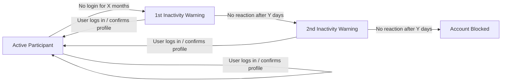

# Deleting, Blocking & Inactivity Management

`hroot` provides comprehensive tools for managing user lifecycle, GDPR compliance, and automated data retention periods (Löschfristen).

---

## Table of Contents

- [1. Manual User Deletion & Blocking](#1-manual-user-deletion--blocking)
  - [Block User](#block-user)
  - [Delete User (Anonymize)](#delete-user-anonymize)
  - [Delete and Blacklist User](#delete-and-blacklist-user)
  - [Erase All User-Related Information](#erase-all-user-related-information)
- [2. Automated Inactivity Lifecycle (Retention Periods / Löschfristen)](#2-automated-inactivity-lifecycle-retention-periods--l%C3%B6schfristen)
  - [Lifecycle Stages](#lifecycle-stages)
  - [Configuration](#configuration)
  - [Background Job Execution](#background-job-execution)

---

## 1. Manual User Deletion & Blocking

To block, anonymize, or delete users manually:
1. Navigate to the **Users** page in the main navigation menu (`/admin/users`).
2. Select the checkbox(es) next to the user(s) you wish to manage.
3. In the upper right dropdown menu **Aktionen** (*Current result*), select **Block or delete selected users...** (*Markierte sperren oder löschen...*).
4. A dialog will appear letting you choose which of the following four actions to perform on the selected accounts:

### Block User
Users will be marked as blocked — they cannot log in anymore, but all data remains in the database. Blocking can be removed by an administrator at any time. Blocked users will not appear on the page for assigning new users, but they will appear on the list of assigned users, styled as crossed out.

### Delete User (Anonymize)
Personal identifying data (name, email, phone, custom fields) is permanently removed. The account remains as an anonymous user record (`user_id`), preserving session statistics, payouts, and participation history without allowing personal identification (GDPR compliant).

### Delete and Blacklist User
Personal data is permanently removed (anonymized), and the email address (and any custom fields marked with `on_delete: :clear_and_block`, such as matriculation numbers) are added to the system **Blacklist**. This prevents the person from creating a new account with the same email or credentials. Blacklist entries can be reviewed and edited under **Site Settings $\rightarrow$ Blacklist** (`/admin/options/blacklist`).

### Erase All User-Related Information
Completely wipes the user record and associated database rows.  
> [!WARNING]
> This permanently deletes all session participation entries, sent email history, and payout ledger entries for this user. Use this only when a complete data purge is explicitly required.

---

## 2. Automated Inactivity Lifecycle (Retention Periods / Löschfristen)

To maintain a healthy participant pool and adhere to institutional data protection regulations, `hroot` features an automated inactivity detection and notification cycle.

### Lifecycle Stages

1. **Phase 1: Inactivity Threshold Reached**
   * When a participant has not signed in for the configured period (e.g., 12 months), the system sends the **1st Inactivity Warning** via Email, SMS, or Push (as defined in the [Communication Matrix](Sending-messages.md)).
   * The message requests the user to log in and confirm that their profile data is still accurate.
2. **Phase 2: Grace Period & Final Warning**
   * If the participant does not log in within the configured grace period (e.g., 7 days), the system dispatches the **2nd Inactivity Warning** as a final notice.
3. **Phase 3: Automatic Account Blocking**
   * If the grace period expires again without any user login or verification, the account is automatically marked as **Blocked** (`blocked: true`).
   * Blocked accounts can subsequently be reviewed and anonymized or purged in bulk by administrators under `/admin/users`.

### Configuration
Administrators can customize the retention intervals under **Site Settings $\rightarrow$ Plugins / Features** (`/admin/options/features`):
* **Inactivity Period until 1st Warning (*Inaktivitätszeitraum bis zur 1. Warnung*)**: Number of months without login before the first warning is sent (default: `12` months).
* **Grace Period between Warnings (*Reaktionsfrist zwischen Warnungen*)**: Number of days between the 1st warning, the 2nd warning, and final automatic account blocking (default: `7` days).

### Background Job Execution
The inactivity check runs automatically via the background cron scheduler (`whenever` / `RecurringTaskService` / `OneYearReminders`). Background job status and execution timestamps can be verified in **Site Settings $\rightarrow$ Experimenter Settings** (`/admin/options/staff_settings`).
